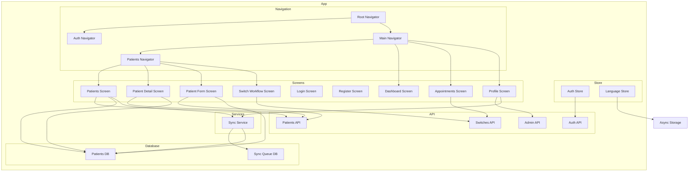

    

    <b>Automatic Architecture Diagrams from Code</b> 
    <a href="https://github.com/swark-io/swark">GitHub</a> • <a href="https://swark.io">Website</a> • <a href="mailto:contact@swark.io">Contact Us</a>

## Usage Instructions

1. **Render the Diagram**: Use the links below to open it in Mermaid Live Editor, or install the [Mermaid Support](https://marketplace.visualstudio.com/items?itemName=bierner.markdown-mermaid) extension.
2. **Recommended Model**: If available for you, use `claude-3.5-sonnet` [language model](vscode://settings/swark.languageModel). It can process more files and generates better diagrams.
3. **Iterate for Best Results**: Language models are non-deterministic. Generate the diagram multiple times and choose the best result.

## Generated Content
**Model**: GPT-4o - [Change Model](vscode://settings/swark.languageModel)  
**Mermaid Live Editor**: [View](https://mermaid.live/view#pako:eNqNls1u2zAMx19F0Ll9gRwGpDAGDOiGbhnQQ72DEjO2MFsKZKnFUPTdp29Llpz0FJH8iZTkP4m84xPvAO9wy3pBLgP63bQMoVkdnbm_XIydeA6SC3A-hPZKDtbx0mKz9lH8JwCPhPWK9BCgYK9AYN2qzP7pW1pEm6GEiSwFnoikwOTsgGCtoMMblacBPBSsFbTvJsp8HbPMwuUBGyLJkcywPkjzkJ6jeUiP8Y-dfipQYBljIWumVFnoAOKVnmBOs3hfyOLNa0lOAoDFHA2ZhyMnonN-nSd6PFp54sjG2xWolgunTE4Znjor2QU_0xGW5M4uwUfeUxYxa5XQL-jpLEFELjg2r9WAJHRc3w059-aur1xMxR7jLHc4uT1z8fc88re4yblR8K_3lZ_wB3mlva7EWbws59J7uTB31TaKjvSz6L5JQdtHNfA7oSwFjV0FgwRSOMqi3OBvY3_MIs4NdH__JTS4CWTzwgbNSjvMqWerdWf71Lk27YZkItwgdNvVgaTFEiJVypVKm1hWbhHQlVQbkEtU05U7_TLt7FsXPVmjsjZ0X8XPw3p09USJGcN-1NXC-U0yHUdFLCqqIplUDZI5sio3sNUwrEPlK27UTF8qlVf9aJ_kUk3dhBfVbKM18bQM3-EJxERop_8RvLdYDjDpTtuhFndwJmqULf7QkLp0REJDiZ5ME95JoeAOEyW5-c7BFlz1A96dyTjDx3-sidwn) | [Edit](https://mermaid.live/edit#pako:eNqNls1u2zAMx19F0Ll9gRwGpDAGDOiGbhnQQ72DEjO2MFsKZKnFUPTdp29Llpz0FJH8iZTkP4m84xPvAO9wy3pBLgP63bQMoVkdnbm_XIydeA6SC3A-hPZKDtbx0mKz9lH8JwCPhPWK9BCgYK9AYN2qzP7pW1pEm6GEiSwFnoikwOTsgGCtoMMblacBPBSsFbTvJsp8HbPMwuUBGyLJkcywPkjzkJ6jeUiP8Y-dfipQYBljIWumVFnoAOKVnmBOs3hfyOLNa0lOAoDFHA2ZhyMnonN-nSd6PFp54sjG2xWolgunTE4Znjor2QU_0xGW5M4uwUfeUxYxa5XQL-jpLEFELjg2r9WAJHRc3w059-aur1xMxR7jLHc4uT1z8fc88re4yblR8K_3lZ_wB3mlva7EWbws59J7uTB31TaKjvSz6L5JQdtHNfA7oSwFjV0FgwRSOMqi3OBvY3_MIs4NdH__JTS4CWTzwgbNSjvMqWerdWf71Lk27YZkItwgdNvVgaTFEiJVypVKm1hWbhHQlVQbkEtU05U7_TLt7FsXPVmjsjZ0X8XPw3p09USJGcN-1NXC-U0yHUdFLCqqIplUDZI5sio3sNUwrEPlK27UTF8qlVf9aJ_kUk3dhBfVbKM18bQM3-EJxERop_8RvLdYDjDpTtuhFndwJmqULf7QkLp0REJDiZ5ME95JoeAOEyW5-c7BFlz1A96dyTjDx3-sidwn)

